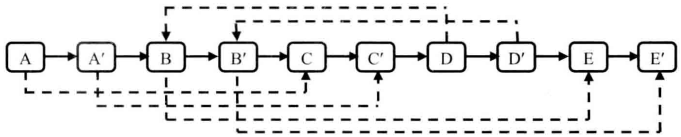

# 目录

<!-- vim-markdown-toc GFM -->

* [剑指offer习题](#剑指offer习题)
	* [1.赋值运算符函数](#1赋值运算符函数)
	* [2.实现Singleton模式](#2实现singleton模式)
	* [4.二维数组中的查找](#4二维数组中的查找)
	* [5.替换空格](#5替换空格)
	* [6.从尾到前打印链表](#6从尾到前打印链表)
	* [7.重建二叉树](#7重建二叉树)
	* [9.用两个栈实现队列](#9用两个栈实现队列)
	* [10.fibonacci数列](#10fibonacci数列)
	* [11.旋转数组的最小数字](#11旋转数组的最小数字)
	* [15.二进制中1的个数](#15二进制中1的个数)
	* [16：数值的整数次方](#16数值的整数次方)
	* [17：打印1到最大的n位数](#17打印1到最大的n位数)
	* [18：在O(1)时间删除链表结点](#18在o1时间删除链表结点)
	* [21：调整数组顺序使奇数位于偶数前面](#21调整数组顺序使奇数位于偶数前面)
	* [22：链表中倒数第k个节点](#22链表中倒数第k个节点)
	* [23：链表中环的入口节点](#23链表中环的入口节点)
	* [24：反转链表](#24反转链表)
	* [25：合并两个排序的链表](#25合并两个排序的链表)
	* [26：树的子结构](#26树的子结构)
	* [面试题27：二叉树的镜像](#面试题27二叉树的镜像)
	* [面试题28：对称的二叉树](#面试题28对称的二叉树)
	* [面试题30：包含min函数的栈](#面试题30包含min函数的栈)
	* [面试题31：栈的压入、弹出序列](#面试题31栈的压入弹出序列)
	* [面试题32：从上到下打印二叉树](#面试题32从上到下打印二叉树)
	* [面试题33：二叉搜索树的后序遍历序列](#面试题33二叉搜索树的后序遍历序列)
	* [面试题34：二叉树中和为某一值的路径](#面试题34二叉树中和为某一值的路径)
	* [面试题35：复杂链表的复制](#面试题35复杂链表的复制)
	* [面试题36：二叉搜索树与双向链表](#面试题36二叉搜索树与双向链表)
	* [面试题37：序列化二叉树](#面试题37序列化二叉树)
	* [面试题38：字符串的排列](#面试题38字符串的排列)

<!-- vim-markdown-toc -->

# 剑指offer习题 

## 1.赋值运算符函数

```c
/*
 * 编写赋值运算符
 *
 * 4. 判断是否为自身赋值，避免释放自身内存。
 * 1. 返回值为引用，才能允许连续赋值
 * 2. 参数为常量引用，提高效率，避免修改
 * 3. 释放已有空间，避免内存泄露
 */
class CMyString{
public:
    CMyString(char *pData = NULL);
    CMyString(const CMyString& str);
    ~CMyString(void);

private:
    char * m_pData;
};

CMyString& CMyString::operator = (const CMyString &str){
    //&str
    if(this == &str) return *this;
    
    delete []m_pData;
    m_pData = NULL;

    m_pData = new char[strlen(str.m_pData)+1];
    strcpy(m_pData, str.m_pData);
    return *this;

    /*
     * 确保异常安全性
     * 生成临时变量，交换m_pData，若由于内存不足抛出异常，不会影响到原先实例。
    if(this != &str){
        CMyString strTemp(str);
        char *pTemp = strTemp.m_pData;
        strTemp.m_pData = m_pData;
        m_pData = pTemp;
    }
    return *this;
    */
}
```

## 2.实现Singleton模式

[Singleton](https://www.cnblogs.com/cxjchen/p/3148582.html)

## 4.二维数组中的查找

题目：在一个二维数组中，每一行都按照从左到右递增的顺序排序，每一列都按照从上到下递增的顺序排序。请完成一个函数，输入这样的一个二维数组和一个整数，判断数组中是否含有该整数。

解法：
可以发现最右一列大于左边任何列，最上一行小于下方任何行  
若从右上开始查找，比如找7：  
7小于9，9所在列可排除  
7小于8，8所在列可排除   
7大于2，2所在行可排除  
7大于4，则往下走，找到值。

```
1 2 8  9
2 4 9  12
4 7 10 13
6 8 11 15
```


```c
class Solution {
public:
    bool Find(int target, vector<vector<int>> array) {
        if (array.empty() || array[0].size() == 0 ) {
            return false;
        }
        int row = array.size();
        int col = array[0].size();
        int row_i = 0;
        int col_j = col-1;
        
        while(row_i < row and col_j >=0){
            if(target == array[row_i][col_j]) return true;
            else if (target < array[row_i][col_j]) col_j--;
            else row_i++;
        }
        return false;
    }
};
```

## 5.替换空格

题目：请实现一个函数，把字符串中的每个空格替换成“%20"。例如输入“We are happy.”，则输出“We%20are%20happy.”。

解法：直接在原数组中操作。

```c
/*
 * 从前往后处理复杂度高，而从后往前处理，O(n).
 * 1. 计算空格数
 * 2. 计算新字符串的长度
 * 3. 从后往前替换字符串。
 */

class Solution {
public:
    //length为字符串空间大小，非字符串长度。
	void replaceSpace(char *str,int length) {
	    if(!str or length == 0 ) return;

        int space_cnt =0;
        //str长度
        int char_cnt = 0; 

        int i = 0;
        while(str[i] != '\0'){
            char_cnt++;
            if(str[i] == ' '){
                space_cnt++;
            }
            i++;
        }
        //新字符串长度
        int new_len = char_cnt + space_cnt*2; 
        if(new_len+1 > length) return;

        //从'\0'开始处理
        int p1 = char_cnt;
        int p2 = new_len;

        while(p1 >= 0 and p1 < p2){
            while(str[p1] != ' '){
                str[p2--] = str[p1--];
            }
            str[p2--] = '0';
            str[p2--] = '2';
            str[p2--] = '%';
            p1--;
        }
	}
};
```

## 6.从尾到前打印链表

题目：输入一个链表的头结点，从尾到头反过来打印出每个结点的值。

解法：将节点进栈再出栈得相反链表

```c
struct ListNode {
      int val;
      struct ListNode *next;
      ListNode(int x) :
            val(x), next(NULL) {
      }
};

class Solution {
public:
    vector<int> printListFromTailToHead(ListNode* head) {
        vector<int> ans;
        stack<ListNode> stk;
        ListNode *p_node = head;
        while(p_node){
            stk.push(*p_node);
            p_node = p_node->next;
        }
        while(!stk.empty()){
            ListNode n = stk.top();
            ans.push_back(n.val);
            stk.pop();
        }
        return ans;
    }
};
```
## 7.重建二叉树

题目：输入某二叉树的前序遍历和中序遍历的结果，请重建出该二文树。假设输入的前序遍历和中序遍历的结果中都不含重复的数字。例如输入前序遍历序列{1，2，4，7，3，5，6，8}和中序遍历序列{4，7，2，1，5，3，8，6}，则重建出图2.6所示的二叉树并输出它的头结点。二叉树结点的定义如下：

解法：前序遍历的第一个元素为该序列的根节点，同时，该节点在中序遍历序列中将其分为左右子树两个序列。通过递归建立该树。


```c
struct TreeNode {
    int val;
    TreeNode *left;
    TreeNode *right;
    TreeNode(int x) : val(x), left(NULL), right(NULL) {}
};

class Solution {
public:
    TreeNode* constructCore(vector<int> pre, int pre_beg, int pre_end, vector<int> in, int in_beg, int in_end){
        if(pre_beg > pre_end or in_beg > in_end) return NULL;

        TreeNode *node = new TreeNode(pre[pre_beg]);
        for(int i = in_beg; i <= in_end; i++){
            if(pre[pre_beg] == in[i]){
                int len_left = i-in_beg;
                node->left = constructCore(pre, pre_beg+1, pre_beg+len_left, in, in_beg, i-1);
                node->right = constructCore(pre, pre_beg+len_left+1, pre_end, in, i+1, in_end);
                break;
            }
        }
        return node;
    }

    TreeNode* reConstructBinaryTree(vector<int> pre,vector<int> in) {
        return constructCore(pre,0,pre.size()-1, in,0,in.size()-1);
    }
}; 
```
 
## 9.用两个栈实现队列

题目：用两个栈实现一个队列。队列的声明如下，请实现它的两个函数appendTail和deleteHead，分别完成在队列尾部插入结点和在队列头部删除结点的功能。

解法：将第一个栈中的数据弹出到第二个栈，再弹出时的顺序就是队列弹出时的顺序。


```c
/*
 * 1.stack1作为队尾，stack2作为队头。
 * 2.出队就是弹出stack2，若其中有元素，直接弹出，若无元素，将stack1所有元素入栈stack2
 */
class Solution
{
public:
    void push(int node) {
        stack1.push(node);
    }

    int pop() {
        int ret = 0;
        if(!stack2.empty()){
            ret = stack2.top();
            stack2.pop();
            return ret;
        }

        while(!stack1.empty()){
            stack2.push(stack1.top());
            stack1.pop();
        }
        ret = stack2.top();
        stack2.pop();
        return ret;
    }

private:
    stack<int> stack1;
    stack<int> stack2;
};
```
 
## 10.fibonacci数列

题目一：写一个函数，输入n，求斐波那契（Fibonacci）数列的第n项。
斐波那契数列的定义如下：


解法：用动态规划，a代表f(n-1),b代表f(n)

```c
class Solution {
public:
    int Fibonacci(int n) {
        int a= 0;
        int b = 1;
        if (n <= 0) b = 0;
        for(int i  = 2; i <= n ; i++){
            b += a;
            a = b-a;
        }
        return b;
    }
};
```

题目二：一只青蛙一次可以跳上1级台阶，也可以跳上2级。求该青蛙跳上一个n级的台阶总共有多少种跳法。

解法：设f(n)为跳台阶的种数，第一次要么1要么2，所以f(n) = f(n-1)+f(n-2)，为fibonacci数列。

需要注意的是，初始条件和上题有些差别

```c
/*
 * 1. n=0 f(n)=0
 * 2. n=1 f(n)=1
 * 3. n=2 f(n)=2
 * 4. n>2 f(n)=f(n-1)+f(n-2)
 */
class Solution {
public:
    int jumpFloor(int n) {
        int a= 1; // f(n-1)
        int b = 2; // f(n)
        if (n <= 0) b = 0;
        else if(n == 1) b = 1;
        
        for(int i  = 3; i <= n ; i++){
            b += a;
            a = b-a;
        }
        return b;
    }
};

```

## 11.旋转数组的最小数字
 
题目：把一个数组最开始的若干个元素搬到数组的末尾，我们称之为数组的旋转。输入一个递增排序的数组的一个旋转，输出旋转数组的最小元素。例如数组{3，4，5，1，2}为（1，2，3，4，5}的一个旋转，该数组的最小值为1。
 
```c
class Solution {
public:
    int minNumberInRotateArray(vector<int> rotateArray) {
        int left = 0;
        int right = rotateArray.size()-1;
        if(left > right) return -1;
        if(rotateArray[left] < rotateArray[right]) return rotateArray[0];
        while(left < right){
            int mid = (left+right)/2;
            if(rotateArray[left] < rotateArray[mid]){
                left = mid;
            }
            else if (rotateArray[mid] < rotateArray[right]){
                right = mid;
            }
            else left++;
        }
        return rotateArray[right];
    }
};
```

## 15.二进制中1的个数
题目：请实现一个函数，输入一个整数，输出该数二进制表示中1的个数。例如把9表示成二进制是1001，有2位是1。因此如果输入9，该函数输出2。

解法：一种是设一个flag，从右往左和该整数作‘与’运算。需要的次数为计算机位数(32或64)。  
另一种是比较有技巧性的，(n-1)&n会将n的最右一个1变为0  
该方法循环的次数是1的个数值。

```c
 class Solution {
 public:
      int  NumberOf1(int n) {
          int cnt = 0;
          int flag = 1;
          while(flag){
              if(n & flag) ++cnt;
              flag = flag << 1;
          }
          return cnt;
      }
 };
```

```c
class Solution {
public:
     int  NumberOf1(int n) {
         int cnt = 0;
         while(n){
             cnt++;
             n = (n-1)&n;
         }
         return cnt;
     }
};
```

## 16：数值的整数次方

题目：实现函数double Power（double base，int exponent），求base的lexponent次方。不得使用库函数，同时不需要考虑大数问题。

解法：
```c
/*
 * 1. 如2^32次方，可以通过2^16平方取得。可用递归。
 * 2. 注意：若指数<0，分母有可能为0。
 */
class Solution {
public:
    double power_recur(double base, int exponent){
        if(exponent == 0) return 1;

        // exponent/2
        double result = power_recur(base,exponent >> 1);
        result *= result;

        //exponent若不能被2整除
        if(exponent&1) result *= base;
        return result;
    }
    double Power(double base, int exponent)
        int exp = exponent;
        if(exponent < 0) {
            exp = -exp;
            //分母不为0
            if(fabs(base-0.0) < 0.0000001) return 0;
        }

        double result = power_recur(base, exp);
        return exponent > 0 ? result : 1/result;
    }
};
```

## 17：打印1到最大的n位数

题目：输入数字n，按顺序打印出从1最大的n位十进制数。比如输入3，则打印出1、2、3一直到最大的3位数即999。

解法：  
* 因为该数可能很大，所以用数组来存。  
* 每个数其实是由‘0’~‘9’排列而成。
* 现只需递归地，从小到大地生成字符串即可
	* 如当n=3：
	* 000, 001, ..., 010, 011, ..., 999.
* 需注意的是，前面的0不必输出，所以输出时要处理一下。

```c
void print_1_to_max_of_digits(int n){
    if(n <= 0) return;
    char number[n+1] = "";
    print_digits_recur(number, n, 0);
}

void print_digits_recur(char * number, int n, int index){
    //此时该数已构建完成，可以输出
    if(index == n){
        print_number(number, n);
        cout << ' ';
        return;
    }
    for(int i = 0; i <= 9; i++){
        number[index] = i+'0';
        print_digits_recur(number, n, index+1);
    }
}

void print_number(char *number, int n){
    int ind = 0;
    while(number[ind] == '0' and ind < n){
        ind++;
    }
    while(ind < n) cout << number[ind++];
}
int main(){
    print_1_to_max_of_digits(4);
    return 0;
}
```

## 18：在O(1)时间删除链表结点

题目：给定单向链表的头指针和一个结点指针，定义一个函数在O(1)时间删除该结点。链表结点与函数的定义如下：

解法:该题给定一个节点的指针，删除链表中的该节点。可以通过将要删除节点的下一个节点的值赋予该删除节点，然后删除下一个节点，以实现删除当前节点的操作。

图中(a)为原数组，(c)为删除过程，i为要删除的节点


```c
struct ListNode{
    int m_nValue;
    ListNode *m_pNext;
};
void delete_node(ListNode **pListHead, ListNode *pToBeDeleted){
   if(!pListHead or !pToBeDeleted) return;

   // 找得到且不为尾结点
   if(pToBeDeleted->m_pNext != NULL){
       ListNode *pNext = pToBeDeleted->m_pNext;
       pToBeDeleted->m_nValue = pNext->m_nValue;
       pToBeDeleted->m_pNext = pNext->m_pNext;

       delete pNext;
       pNext = NULL;
   }

   // 找得到且为尾结点同时为头结点, pListHead需置为空
   else if(*pListHead == pToBeDeleted){
       delete pToBeDeleted;
       pToBeDeleted = NULL;
       *pListHead = NULL;
   }

   // 找得到且为尾结点(非头结点)
   else{
       ListNode *pNode = *pListHead;
       while(pNode->m_pNext != pToBeDeleted){
           pNode = pNode->m_pNext;
       }

       pNode->m_pNext = NULL;
       deelte pToBeDeleted;
       pToBeDeleted = NULL;
    }
}
```

## 21：调整数组顺序使奇数位于偶数前面

题目：输入一个整数数组，实现一个函数来调整该数组中数字的顺序，使得所有奇数位于数组的前半部分，所有偶数位于数组的后半部分。

解法一:  
前后各设置一个指针，往中间遍历，若发现不符合的两个数字，互换。

```c
void ReorderOddEven_1(int *p_data, int length){
    if(!p_data or length==0) return;

    int *p_beg = p_data;
    int *p_end = p_data+length-1;

    while(p_beg < p_end){
        // odd
        while(p_beg < p_end and (*p_beg & 1)){
            p_beg++;
        }
        // even
        while(p_beg < p_end and !(*p_beg & 1)){
            p_end--;
        }
        int tmp = *p_beg;
        *p_beg = *p_end;
        *p_end = tmp;
    }
}
```

解法二：  
若把题目条件改成负数在非负前面或者不能被3整除的在能被3整除的前面，需要修改while中的判断条件，而加了一个函数指针后，只需要传入相应函数即可判断，提高了程序健壮性


```c
void ReorderOddEven_2(int *pData, unsigned int length)
{
    Reorder(pData, length, is_even);
}

bool is_even(int num){
    return (num&1) == 0;
}
void Reorder(int *p_data, int length, bool (*fun)(int)){
    if(!p_data or length==0) return;

    int *p_beg = p_data;
    int *p_end = p_data+length-1;

    while(p_beg < p_end){
        // odd
        while(p_beg < p_end and !fun(*p_beg)){
            p_beg++;
        }
        // even
        while(p_beg < p_end and fun(*p_end)){
            p_end--;
        }
        int tmp = *p_beg;
        *p_beg = *p_end;
        *p_end = tmp;
    }
}
```

## 22：链表中倒数第k个节点

题目：输入一个链表，输出该链表中倒数第k个节点。为了符合大多数人的习惯，本题从1开始计数，即链表的尾节点是倒数第1个节点。例如，一个链表有6个节点，从头节点开始，它们的值依次是1、2、3、4、5、6。这个链表的倒数第3个节点是值为4的节点。链表节点定义如下：

解法： 用双指针，指针距离为k，只需遍历一次链表即可得答案。

注意：k可能大于链表长度。  

```c
struct ListNode{
    int m_nValue;
    ListNode *m_pNext;
}

ListNode* FindKthToTail(ListNode *p_list_head, int k){
    if(!p_list_head or k <= 0) return nullptr;

    ListNode *p1 = p_list_head;
    ListNode *p2 = p1;

    // 若下个节点存在，往下循环。
    while(--k and p2->m_pNext){
        p2 = p2->m_pNext;
    }

    // 若k不为0，说明k大于链表长度.
    if(k){
        return nullptr;
    }

    while(p2->m_pNext){
        p1 = p1->m_pNext;
        p2 = p2->m_pNext;
    }
    return p1;
}
```

## 23：链表中环的入口节点

题目：如果一个链表中包含环，如何找出环的入口节点？例如，在如图3.8所示的链表中，环的入口节点是节点3。

解法：  
1. 先判断有没有环
	* 设置两个指针，一个快一个慢，若快的能追上慢的，则有环
2. 再判断入口节点
	* 设置两个指针，设环有n个节点，则让其中一个先跑n个节点，然后两个指针往前走，一次各走一步，碰面时就位于入口处。（因为在环中，距离为n+1的节点位于相同位置）  


```c
struct ListNode{
    int m_nValue;
    ListNode *m_pNext;
}
ListNode* MeetingNode(ListNode *p_head){
    ListNode *p_slow = p_head;
    ListNode *p_fast = p_slow;

    while(p_fast){
        p_slow = p_slow->m_pNext;
        p_fast = p_fast->m_pNext;
        if(p_fast)
            p_fast = p_fast->m_pNext;

        if(p_slow == p_fast) return p_fast;
    }

    return nullptr;
}

ListNode* EntryNodeOfLoop(ListNode *p_head){

    ListNode *node = MeetingNode(p_head);
    if(!node) return nullptr;

    int loop_node_cnt = 1;
    ListNode *tmp_node = node;
    tmp_node = tmp_node->m_pNext;

	//计算环的长度
    while(tmp_node != node){
        tmp_node = tmp_node->m_pNext;
        loop_node_cnt++;
    }

    ListNode *p1 = p_head;
    ListNode *p2 = p_head;

    while(loop_node_cnt--){
        p2 = p2->m_pNext;
    }

    while(p1 != p2){
        p1 = p1->m_pNext;
        p2 = p2->m_pNext;
    }
    return p2;
}
```

## 24：反转链表

题目：定义一个函数，输入一个链表的头节点，反转该链表并输出反转后链表的头节点。链表节点定义如下：

解法：
* 在反转链表的时候，链表会断，所以要把下下个节点保存起来。  
* 只有一个节点的情况要注意下。


注意：书中把当前节点设为中间的那个，代码会比较统一。我用的第一个为当前节点比较复杂。

```c
struct ListNode{
    int m_nValue;
    ListNode *m_pNext;
}
ListNode *ReverseList(ListNode *p_head){
    if(!p_head) return nullptr;

    ListNode *cur = p_head; //first node
    ListNode *next = cur->m_pNext; //second node
    cur->m_pNext = nullptr; 

    //only one node exists.
    if(!next) return p_head;

    ListNode *next_next = next->m_pNext; //third node
    while(1){
        next->m_pNext = cur;

        cur = next;
        next = next_next;

        if(!next) break;
        next_next = next->m_pNext;
    }

    return cur;
}
```

## 25：合并两个排序的链表

题目：输入两个递增排序的链表，合并这两个链表并使新链表中的节点仍然是递增排序的。例如，输入图3.11中的链表1和链表2，则合并之后的升序链表如链表3所示。链表节点定义如下：

解法：判断前两个数字，取小的作为头节点，递归往下执行。


```c
ListNode* merge(ListNode *p_head1, ListNode *p_head2){
    // p_head2 or p_head1 is null.
    if(!p_head1) return p_head2;
    else if(!p_head2) return p_head1;

    ListNode *p_head = nullptr;

    if(p_head1->m_nValue < p_head2->m_nValue){
        p_head1->m_pNext = merge(p_head1->m_pNext, p_head2);
        p_head = p_head1;
    }
    else{
        p_head2->m_pNext = merge(p_head1, p_head2->m_pNext);
        p_head = p_head2;
    }

    return p_head;
}
```

## 26：树的子结构

题目：输入两棵二叉树A和B，判断B是不是A的子结构。二叉树节点的定义如下：

解法：  
* 首先找到第二棵树的根节点在第一棵树上的位置，然后看是否是第一棵树的子树(递归)


注意：DoesTree1HaveTree2中:  
若第二棵树遍历到空节点了，说明它上面的节点都符合要求，所以返回true。  
若第二棵树节点不为空，第一棵树的节点为空，说明第二棵不是子树。

```c
bool DoesTree1HaveTree2(BinaryTreeNode* p_root1, BinaryTreeNode* p_root2){
    bool res = false;

	//!!
    if(!p_root2) return true;
    if(!p_root1) return false;

    //std::cout <<"p_root1:" << p_root1->m_dbValue <<" p_root2:" <<p_root2->m_dbValue << std::endl;;
    if(fabs(p_root1->m_dbValue-p_root2->m_dbValue) < 0.0000001){
        res = DoesTree1HaveTree2(p_root1->m_pLeft, p_root2->m_pLeft);
        res = res and DoesTree1HaveTree2(p_root1->m_pRight, p_root2->m_pRight);
    }
    return res;
}

bool HasSubtree(BinaryTreeNode* p_root1, BinaryTreeNode* p_root2){
    bool res = false;

    if(!p_root2 or !p_root1) return false;

    if(fabs(p_root1->m_dbValue-p_root2->m_dbValue) < 0.0000001) {
        res = DoesTree1HaveTree2(p_root1, p_root2);
    }

    if(!res){
        res = HasSubtree(p_root1->m_pLeft, p_root2);
        res = res or HasSubtree(p_root1->m_pRight, p_root2);
    }
    return res;
}
```

## 面试题27：二叉树的镜像

题目：请完成一个函数，输入一棵二叉树，该函数输出它的镜像。叉树节点的定义如下：

解法：只需要递归地把, 左右子树互换。

```c
void MirrorRecursively(BinaryTreeNode *p_node) {
    if( !p_node ) return;
	
	//swap nodes.
    BinaryTreeNode *tmp_node = p_node->m_pLeft;
    p_node->m_pLeft = p_node->m_pRight;
    p_node->m_pRight = tmp_node;

    MirrorRecursively(p_node->m_pRight);
    MirrorRecursively(p_node->m_pLeft);
}
```

## 面试题28：对称的二叉树

题目：请实现一个函数，用来判断一棵二叉树是不是对称的。如果一棵二叉树和它的镜像一样，那么它是对称的。例如，在如图4.3所示的3棵二叉树中，第一棵二叉树是对称的，而另外两棵不是。

解法：看它的前序遍历序列(前左右)和镜像的前序遍历序列(前右左)是否相同


```c
//==========func============
bool isSymmetrical(BinaryTreeNode *p_root1, BinaryTreeNode *p_root2) {
    if(!p_root2 and !p_root1) return true;

    if(p_root1 and p_root2) {
        bool res = isSymmetrical(p_root1->m_pLeft, p_root2->m_pRight) and
            isSymmetrical(p_root1->m_pRight, p_root2->m_pLeft);
        if(p_root1->m_nValue == p_root2->m_nValue and res) return true;
    }
    return false;
}

bool isSymmetrical(BinaryTreeNode *p_root){
    if(!p_root) return true;
    return isSymmetrical(p_root->m_pLeft, p_root->m_pRight);
}
```

## 面试题30：包含min函数的栈

题目：定义栈的数据结构，请在该类型中实现一个能够得到栈的最小元素的min函数。在该栈中，调用min、push及pop的时间复杂度都是O（1）。 

解法：首先想到的是用变量保存最小值，但是一旦最小值被弹出，就得找比当前值小的那个最小值。也就是说，最小值随时可能被弹出，我们需要找到弹出后的栈内的最小值。所以想到要用另外一个栈来保存当前栈的最小值。


```c
template <typename T>
void StackWithMin<T>::push(const T& val){
    m_data.push(val);

    if(m_min.size() == 0 or val < m_min.top())
        m_min.push(val);
    else m_min.push(m_min.top());
}

template <typename T>
void StackWithMin<T>::pop(){
    assert (m_data.size() > 0 and m_min.size() > 0);
    m_data.pop();
    m_min.pop();
}

template <typename T>
const T& StackWithMin<T>::min() const{
    assert (m_data.size() > 0 and m_min.size() > 0);
    return m_min.top();
}
```

## 面试题31：栈的压入、弹出序列

题目：输入两个整数序列，第一个序列表示栈的压入顺序，请判断第二个序列是否为该栈的弹出顺序。假设压入栈的所有数字**均不相等**。例如，序列{1，2，3，4，5}是某栈的压栈序列，序列{4，5，3，2，1}是该压栈序列对应的一个弹出序列，但{4，3，5，1，2}就不可能是该压栈序列的弹出序列。

解法：因为要以p_pop序列弹出，所以：  
2. p_push序列必须不停压栈，直到要压的值等于p_pop当前要弹出的值  
1. 若要弹出的值等于栈顶值，直接弹出  

注意：c数组的末尾无法像c++一样用.end()，得自己算出位置。

```c
bool IsPopOrder(const int *p_push, const int *p_pop, int length){
    std::stack<int> st;
    const int *p_pop_end = p_pop + length;
    const int *p_push_end = p_push + length;
    if(!p_push or !p_pop) return false;

    while(p_pop != p_pop_end){
        if(st.size() and *p_pop == st.top()) {
            st.pop();
            p_pop++;
        }
        else {
            while(p_push!=p_push_end and *p_push != *p_pop) {
                st.push(*p_push);
                p_push++;
            }
            if(p_push==p_push_end) return false;

            p_pop++;
            p_push++;
        }
    }
    return true;
}
```

## 面试题32：从上到下打印二叉树

题目一：不分行从上到下打印二叉树
从上到下打印出二又树的每个节点，同一层的节点按照从左到右的顺序打印。例如，输入图4.6中的二叉树，则依次打印出8，6，10，5，7，9，11。二叉树节点的定义如下：

解法：广度优先遍历，可以用队列

```c
void PrintFromTopToBottom(BinaryTreeNode *p_tree_root){
    if(!p_tree_root) return;

    std::deque<BinaryTreeNode *> deq;
    deq.push_back(p_tree_root);
    while(!deq.empty()){
        BinaryTreeNode *node = deq.front();
        deq.pop_front();
        printf("%d ",node->m_nValue);
        if(node->m_pLeft)
            deq.push_back(node->m_pLeft);
        if(node->m_pRight)
            deq.push_back(node->m_pRight);
    }
}
```

题目二：分行从上到下打印二叉树。  
从上到下按层打印二叉树，同一层的节点按从左到右的顺序打印，每一层打印到一行。例如，打印图4.7中二叉树的结果为：

解法：只需在合适的地方输入换行符即可,在上题基础上小修改一下。 当前行不断出队，下一行不断进队，我们需要记录这两行的结束位置，所以设置两个变量保存其长度。当当前行输出结束，输出一个换行符，进入下一个循环。


```c
void Print(BinaryTreeNode* p_tree_root){
    if(!p_tree_root) return;

    std::deque<BinaryTreeNode *> deq;
    deq.push_back(p_tree_root);

    int cnt_cur = 1;
    int cnt_next = 0;
    while(!deq.empty()){
        BinaryTreeNode *node = deq.front();
        deq.pop_front();
        cnt_cur--;
        printf("%d ",node->m_nValue);

        if(node->m_pLeft){
            deq.push_back(node->m_pLeft);
            cnt_next++;
        }

        if(node->m_pRight){
            deq.push_back(node->m_pRight);
            cnt_next++;
        }

        if(!cnt_cur){
            printf("\n");
            cnt_cur = cnt_next;
            cnt_next = 0;
        }
    }
}
```

题目三：之字形打印二叉树。  
请实现一个函数按照之字形顺序打印二叉树，即第一行按照从左到右的顺序打印，第二层按照从右到左的顺序打印，第三行再按照从左到右的顺序打印，其他行以此类推。例如，按之字形顺序打印图4.8中二叉树的结果为：

解法：因为每次都是上一次的相反顺序，所以可以用栈。如图：


```c
void Print(BinaryTreeNode *p_root){
    if(!p_root) return;

    std::stack<BinaryTreeNode *> stk1;
    std::stack<BinaryTreeNode *> stk2;

    stk1.push(p_root);

    while(!stk1.empty() or !stk2.empty()){
        if(stk2.empty()){
            while(!stk1.empty()){
                BinaryTreeNode *node = stk1.top();
                stk1.pop();
                printf("%d ", node->m_nValue);
                if(node->m_pLeft){
                    stk2.push(node->m_pLeft);
                }
                if(node->m_pRight){
                    stk2.push(node->m_pRight);
                }
            }
            printf("\n");
        }
        else if(stk1.empty()){
            while(!stk2.empty()){
                BinaryTreeNode *node = stk2.top();
                stk2.pop();
                printf("%d ", node->m_nValue);
                if(node->m_pRight){
                    stk1.push(node->m_pRight);
                }
                if(node->m_pLeft){
                    stk1.push(node->m_pLeft);
                }
            }
            printf("\n");
        }
    }
}
```

## 面试题33：二叉搜索树的后序遍历序列

题目：输入一个整数数组，判断该数组是不是某二叉搜索树的后序遍历结果。如果是则返回true，否则返回false。假设输入的数组的任意两个数字都互不相同。例如，输入数组{5，7，6，9，11，10，8}，则返回true，因为这个整数序列是图4.9二叉搜索树的后序遍历结果。如果输入的数组是{7，4，6，5}，则由于没有哪棵二叉搜索树的后序遍历结果是这个序列，因此返回false。

注意：题目说的是二叉搜索树，也就是中序遍历为有序数列的树，不是普通树。

解法：因为后序遍历的最后一个节点为根节点，而该树又为二叉搜索树，所以数组最后一个数前面的数能被分为两部分，前一部分比根节点小，后一部分比根节点大。而这两部分又分别为一个后序遍历序列，也满足如上规则，所以可以用递归。  
若能被成功分为一小一大两部分，**或少于两部分**。大于两部分就说明不是个二叉搜索树，则返回true  
若不能，则false


```c
bool VertifySequenceOfBST(int seq[], int length){
    if(!seq) return false;
    if(!length) return true;

    int i = length-1;
    int val = seq[i--];
    int right_tree_len = 0;

    while(i>=0 and seq[i] > val){
        i--;
        right_tree_len++;
    }
    while(i>=0 and seq[i] < val){
        i--;
    }
    if(i == -1) return true;
    else return false;

    int left_tree_len = length-right_tree_len-1;
    VertifySequenceOfBST(seq,left_tree_len);
    VertifySequenceOfBST(seq+left_tree_len,left_tree_len);
}
```

## 面试题34：二叉树中和为某一值的路径

题目：输入一棵二叉树和一个整数，打印出二叉树中节点值的和为输入整数的所有路径。从树的根节点开始往下一直到叶节点所经过的节点形成一条路径。二叉树节点的定义如下：

注意：题目是要求开始节点为根，结束节点为叶结点。我一开始以为是随便节点都行。后面实现的代码没满足第二个要求（结束为叶结点）,不过加个判断语句就行了。

解法：用前序遍历，若碰到当前节点和sum值相同，说明路径已经建立好，可以输出了。我用一个队列保存了输出路径。

```c
void FindPath(BinaryTreeNode *p_root, int sum, std::queue<BinaryTreeNode *> que){
    if(!p_root or sum < 0) return;

    //printf("p_root value: %d\n", p_root->m_nValue);
    que.push(p_root);

    if(p_root->m_nValue == sum){
        while (!que.empty()){
            printf("%d ", que.front()->m_nValue);
            que.pop();
        }
        printf("\n");
        return;
    }

    int next_sum = sum-p_root->m_nValue;
    if(p_root->m_pLeft)
        FindPath(p_root->m_pLeft, next_sum, que);

    if(p_root->m_pRight)
        FindPath(p_root->m_pRight, next_sum, que);
}

void FindPath(BinaryTreeNode *p_root, int sum){
    std::queue<BinaryTreeNode *> que;
    FindPath(p_root, sum, que);
}
```

## 面试题35：复杂链表的复制

题目：请实现函数ComplexListNode*Clone（ComplexListNode*pHead），复制一个复杂链表。在复杂链表中，每个节点除了有一个m_pNext 指针指向下一个节点，还有一个m_pSibling指针指向链表中的任意节点或者nullptr。节点的C++定义如下：

解法：若顺序创建链表节点及其next、sibling，因为m_pSibling可能在当前节点的后面，此时还没有创建该节点，所以这样不合适。  
我们可以先把整条链表的next先连接起来，再连接sibling。  
关于连接sibling，有三种实现方法:  
先假设克隆前的链表为list_old, 克隆后的为list_new.  
1. 因为不知道要连接的节点在当前节点的前面还是后面，所以每次设置sibling都要两条链表同时往后遍历，直到碰到list_old的sibling节点，同时，list_new的当前节点也就是要链接的sibling节点了。复杂度为O(n^2)  
2. 第二种是用一个映射数组存储list_old和list_new节点的一一对应关系，这样就能在O(1)时间内找到ilst_old的sibling对应的list_new的sibling.但是这会消耗额外的空间。
3. 第三种在每个list_old节点后面新建每个节点的克隆，也即该结构默认表示了一种一一对应的关系，设置sibling的时候也能直接找到节点。最后将两个链表拆开，就获得了克隆的复杂链表。



这里用第三种来解题，步骤如下：  
1. 将链表复制一遍
2. 连接sibling
3. 分开两条链表


```c
ComplexListNode *CloneNodes(ComplexListNode *p_head){
    if(!p_head) return nullptr;

    ComplexListNode *p_node_new = new ComplexListNode(p_head->m_nValue);
    CloneNodes(p_head->m_pNext);

    ComplexListNode *p_head_next = p_head->m_pNext;
    p_head->m_pNext = p_node_new;
    p_node_new->m_pNext = p_head_next;

    return p_head;
}

ComplexListNode *ConnectSiblings(ComplexListNode *p_head){
    if(!p_head) return nullptr;

    ComplexListNode *p_head_next = p_head->m_pNext;

    if(!p_head->m_pSibling) p_head_next->m_pSibling = nullptr;
    else p_head_next->m_pSibling = p_head->m_pSibling->m_pNext;

    ConnectSiblings(p_head_next->m_pNext);
    return p_head;
}

ComplexListNode *getCloneList(ComplexListNode *p_head){
    if(!p_head) return nullptr;

    ComplexListNode *p_head_next = p_head->m_pNext;

    p_head->m_pNext = p_head_next->m_pNext;
    p_head_next->m_pNext = getCloneList(p_head_next->m_pNext);

    return p_head_next;
}

void print_list_test(ComplexListNode *p_head){
    ComplexListNode *node = p_head;
    while(node){
        printf("%d",node->m_nValue );
        if(node->m_pSibling){
            printf("->%d ",node->m_pSibling->m_nValue);
        }
        else printf(" ");
        node = node->m_pNext;
    }

    printf("\n");
}
ComplexListNode *Clone(ComplexListNode *p_head){
    CloneNodes(p_head);
    printf("CloneNodes() result:\n");
    print_list_test(p_head);
    ConnectSiblings(p_head);
    printf("ConnectSiblings() result:\n");
    print_list_test(p_head);
    ComplexListNode *res = getCloneList(p_head);
    printf("ComplexListNode() result:\n");
    print_list_test(p_head);
    return res;
}
```

## 面试题36：二叉搜索树与双向链表

题目：输入一棵二叉搜索树，将该二叉搜索树转换成一个排序的双向链表。要求不能创建任何新的节点，只能调整树中节点指针的指向。比如，输入图4.15中左边的二叉搜索树，则输出转换之后的排序双向链表。二叉树节点的定义如下：

解法：我的实现是先构建左子树，根节点左指针指向左子树最右节点，根节点右指针指向右子树最左节点。这方法比较繁琐，逻辑较书中的比较复杂。  
书中是用一个变量保存当前树最右节点。然后递归地构建左子树的双向链表->(根节点+左子树)的双向链表->(根+左+右)子树的双向链表。逻辑清晰易实现。

```c

#define LEFT 0
#define RIGHT 1
struct BinaryTreeNode
{
    int                    m_nValue;
    BinaryTreeNode*        m_pLeft;
    BinaryTreeNode*        m_pRight;
};
BinaryTreeNode *Convert(BinaryTreeNode *p_root, int L_or_R){
    if(!p_root) return nullptr;

    //printf("%d\n", p_root->m_nValue);
    /*if( p_root->m_nValue== 6){
        printf("");
    }
    */
    BinaryTreeNode *p_root_left = Convert(p_root->m_pLeft, LEFT);
    BinaryTreeNode *p_root_right = Convert(p_root->m_pRight, RIGHT);

    if(!p_root_left and !p_root_right) return p_root;

    if(p_root_left){
        //printf("p_root_left: %d\n", p_root_left->m_nValue);
        p_root->m_pLeft = p_root_left;
        p_root_left->m_pRight = p_root;
    }

    if(p_root_right){
        //printf("p_root_right: %d\n", p_root_right->m_nValue);
        p_root->m_pRight = p_root_right;
        p_root_right->m_pLeft = p_root;
    }

    BinaryTreeNode *p_node_loop = p_root;
    //current subtree is a left subtree
    if(!L_or_R) while(p_node_loop->m_pRight)
            p_node_loop= p_node_loop->m_pRight;
    //current subtree is a right subtree
    else while(p_node_loop->m_pLeft)
            p_node_loop= p_node_loop->m_pLeft;

    return p_node_loop; //[x]p_node_prev

}
BinaryTreeNode *Convert(BinaryTreeNode *p_root){
    return Convert(p_root, RIGHT);
} 
```

## 面试题37：序列化二叉树

题目：请实现两个函数，分别用来序列化和反序列化二叉树。

解法：首先想到的是前序和中序能确定一棵树，但是这要求二叉树里不能有相同值的节点，而且得前序中序都知道才能开始反序列化。  
书中用符号'$'替代空字符，用前序遍历作为序列化的方法，因为这是从根节点开始的，反序列化可以马上根据序列化的输出反序列化出结果。

注意：反序列化函数参数也可用`**`:
```c
void Deserialize(BinaryTreeNode **p_root, istream& stream){
    int num = 0;
    if(ReadStream(stream, &num)){
        *p_root = new BinaryTreeNode(num);
        Deserialize(&(*p_root)->m_pLeft, stream);
        Deserialize(&(*p_root)->m_pRight, stream);
    }
}
```

```c
struct BinaryTreeNode
{
    int                    m_nValue;
    BinaryTreeNode*        m_pLeft;
    BinaryTreeNode*        m_pRight;
    BinaryTreeNode(int val = 0):m_nValue(val),m_pRight(nullptr),m_pLeft(nullptr){};
};

bool ReadStream(istream& stream, int *num){
    char buffer[33] = "";

    char ch;
    int i = 0;
    while((stream>>ch) and ch != ','){
        buffer[i++] = ch;
    }

    bool is_num = false;
    if(!stream.eof() and buffer[0] != '$'){
        *num = atoi(buffer);
        is_num = true;
    }
    return is_num;
}

void Serialize(const BinaryTreeNode *p_root, ostream& stream){
    if(!p_root) {
        stream << "$,";
        return;
    }

    stream << p_root->m_nValue << ',' ;

    Serialize(p_root->m_pLeft,stream);
    Serialize(p_root->m_pRight,stream);
}
void Deserialize(BinaryTreeNode *&p_root, istream& stream){
    int num = 0;
    if(ReadStream(stream, &num)){
        p_root = new BinaryTreeNode(num);
        Deserialize(p_root->m_pLeft, stream);
        Deserialize(p_root->m_pRight, stream);
    }
}
```

## 面试题38：字符串的排列

题目：输入一个字符串，打印出该字符串中字符的所有排列。例如，输入字符串abc，则打印出由字符a、b、c所能排列出来的所有字符串abc、acb、bac、bca、cab和cba。

解法：将每个字符轮流作为首字符，输出其全排列。递归执行即可。

注意：我没想到参数是多加一个beg变量，我第一次写的时候用一个int变量记录长度，每次只输出一个字符，做不出来。后面才明白每次都要输出整个字符串，而不是每次输出一个字符。

```c
void Permutation(char* p_str, char* p_beg){
    if(*p_beg == '\0') {
        printf("%s\n", p_str);
        return;
    }

    for(char* p_ch = p_beg; *p_ch != '\0'; ++p_ch) {
        std::swap(*p_ch,*p_beg);
        Permutation(p_str, p_beg + 1);
        std::swap(*p_ch,*p_beg);
    }
}

void Permutation(char* p_str){
    if(p_str == nullptr) return;
    Permutation(p_str, p_str);
}
```


